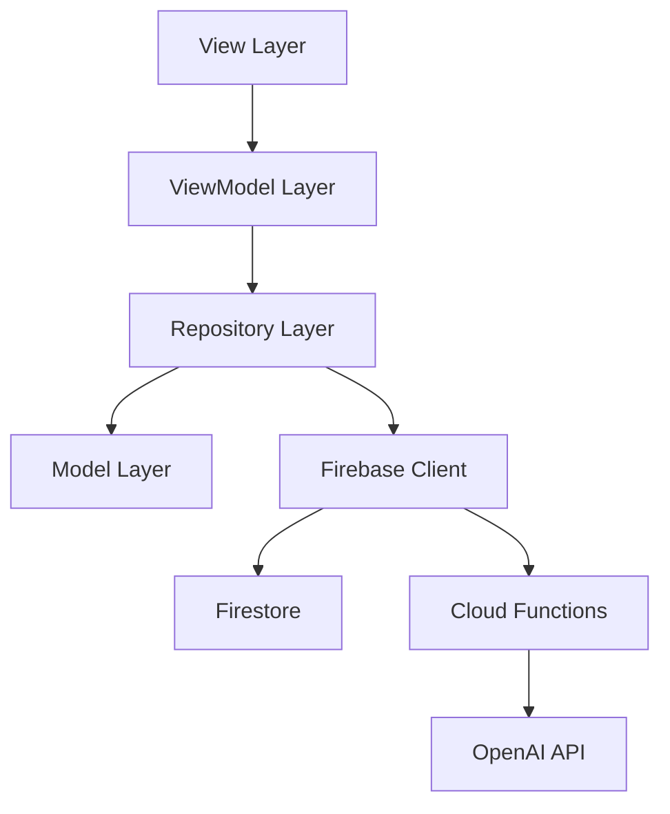
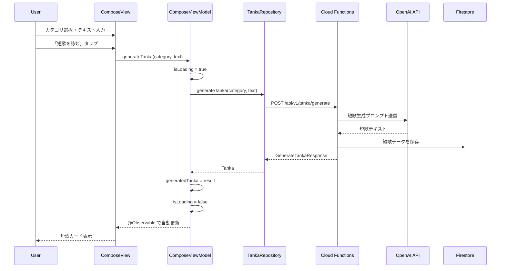
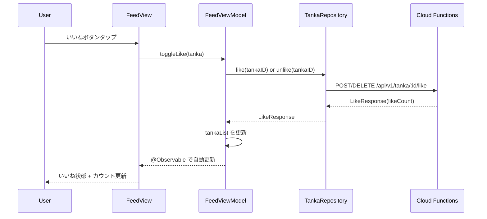

# アーキテクチャ設計書

> 生成日時: 2026-02-27
> ステータス: Draft
> 入力: docs/product-requirements.md, docs/functional-design.md, CLAUDE.md

## 1. アーキテクチャ概要



### 各レイヤーの責務

| レイヤー | 責務 | 依存先 |
|---|---|---|
| View | UI 表示・ユーザー操作のハンドリング。ビジネスロジックを含まない | ViewModel |
| ViewModel | 状態管理・ビジネスロジックの実行。`@Observable` で状態を公開 | Repository |
| Repository | データアクセスの抽象化。Firestore / Cloud Functions への通信 | Model, Firebase Client |
| Model | データ構造の定義。`Codable, Sendable, Identifiable` 準拠 | なし |

### 依存方向の原則

- **一方向のみ**: View → ViewModel → Repository → Model
- 逆方向の依存は禁止（Repository が ViewModel を参照しない等）
- 同一レイヤー間の直接依存は避ける

## 2. 技術スタック

| 技術 | 用途 | 選定理由 |
|---|---|---|
| Swift 6.2 | 言語 | 最新の Concurrency サポート、厳格な Sendable チェック |
| SwiftUI | UI フレームワーク | 宣言的 UI、iOS 17+ ネイティブ |
| Observation | 状態管理 | `@Observable` によるシンプルで高性能な状態管理 |
| Swift Concurrency | 非同期処理 | `async/await`, `Sendable` による型安全な並行処理 |
| Firebase iOS SDK | バックエンド連携 | Firestore（データ保存）、Cloud Functions（API）、Anonymous Auth（認証） |
| OpenAI API | 短歌生成 | Cloud Functions 経由で呼び出し。クライアントに API キーを含めない |
| XcodeGen | プロジェクト生成 | `project.yml` による宣言的なプロジェクト管理 |
| SwiftLint / SwiftFormat | コード品質 | Mint で管理。一貫したコーディングスタイル |

## 3. レイヤー設計

### 3.1 View 層

```swift
struct FeedView: View {
    @State private var viewModel = FeedViewModel()

    var body: some View {
        ScrollView {
            LazyVStack(spacing: 24) {
                ForEach(viewModel.tankaList) { tanka in
                    TankaCard(tanka: tanka) {
                        await viewModel.toggleLike(for: tanka)
                    }
                    .contextMenu {
                        Button("通報する") {
                            viewModel.reportTarget = tanka
                        }
                        Button("ブロックする") {
                            viewModel.blockTarget = tanka
                        }
                    }
                }
            }
        }
        .task {
            await viewModel.loadFeed()
        }
    }
}
```

**設計方針:**
- `@State` で ViewModel のオーナーシップを持つ
- `@Environment` で依存（Repository）を注入する
- View にビジネスロジックを記述しない
- `.task` で非同期処理を開始する

### 3.2 ViewModel 層

```swift
@Observable
@MainActor
final class FeedViewModel {
    private(set) var tankaList: [Tanka] = []
    private(set) var isLoading = false
    private(set) var error: AppError?
    private(set) var hasMore = true
    var reportTarget: Tanka?
    var blockTarget: Tanka?

    private let tankaRepository: any TankaRepositoryProtocol

    init(tankaRepository: any TankaRepositoryProtocol = TankaRepository()) {
        self.tankaRepository = tankaRepository
    }

    func loadFeed() async {
        isLoading = true
        defer { isLoading = false }
        do {
            let response = try await tankaRepository.fetchFeed(limit: 20, afterID: nil)
            tankaList = response.tankaList
            hasMore = response.hasMore
            error = nil
        } catch {
            self.error = AppError(error)
        }
    }

    func toggleLike(for tanka: Tanka) async {
        do {
            if tanka.isLikedByMe {
                let response = try await tankaRepository.unlike(tankaID: tanka.id)
                updateLikeState(tankaID: tanka.id, isLiked: false, count: response.likeCount)
            } else {
                let response = try await tankaRepository.like(tankaID: tanka.id)
                updateLikeState(tankaID: tanka.id, isLiked: true, count: response.likeCount)
            }
        } catch {
            self.error = AppError(error)
        }
    }

    private func updateLikeState(tankaID: String, isLiked: Bool, count: Int) {
        guard let index = tankaList.firstIndex(where: { $0.id == tankaID }) else { return }
        tankaList[index].isLikedByMe = isLiked
        tankaList[index].likeCount = count
    }
}
```

**設計方針:**
- `@Observable` マクロを使用する（`ObservableObject` は非推奨）
- `@MainActor` を ViewModel クラスに適用する
- 状態プロパティは `private(set)` で外部からの直接変更を防ぐ
- アクションメソッドは `async` で定義する

### 3.3 Repository 層

```swift
protocol TankaRepositoryProtocol: Sendable {
    func generateTanka(category: WorryCategory, worryText: String) async throws -> Tanka
    func fetchFeed(limit: Int, afterID: String?) async throws -> FeedResponse
    func fetchMyTanka() async throws -> [Tanka]
    func like(tankaID: String) async throws -> LikeResponse
    func unlike(tankaID: String) async throws -> LikeResponse
    func report(tankaID: String, reason: ReportReason) async throws
    func blockUser(userID: String) async throws
    func unblockUser(userID: String) async throws
    func fetchBlockedUsers() async throws -> [BlockedUser]
    func deleteAccount() async throws
}

final class TankaRepository: TankaRepositoryProtocol {
    private let apiClient: APIClient

    init(apiClient: APIClient = .shared) {
        self.apiClient = apiClient
    }

    func generateTanka(category: WorryCategory, worryText: String) async throws -> Tanka {
        let request = GenerateTankaRequest(category: category, worryText: worryText)
        let response: GenerateTankaResponse = try await apiClient.post("/api/v1/tanka/generate", body: request)
        return response.tanka
    }

    func fetchFeed(limit: Int, afterID: String?) async throws -> FeedResponse {
        var params: [String: String] = ["limit": "\(limit)"]
        if let afterID { params["afterID"] = afterID }
        return try await apiClient.get("/api/v1/tanka/feed", parameters: params)
    }

    // ... 他メソッドも同様
}
```

**設計方針:**
- Protocol で抽象化し、テスト時に Mock に差し替え可能にする
- `Sendable` に準拠する
- `async throws` メソッドで定義する

### 3.4 Model 層

```swift
struct Tanka: Codable, Sendable, Identifiable {
    let id: String
    let authorID: String
    let category: WorryCategory
    let worryText: String
    let tankaText: String
    var likeCount: Int
    var isLikedByMe: Bool
    let createdAt: Date
}
```

**設計方針:**
- `Codable`, `Sendable`, `Identifiable` に準拠する struct
- イミュータブル（`let`）を基本とする
- クライアント側で変更するプロパティ（`likeCount`, `isLikedByMe`）のみ `var`

## 4. DI 戦略

```swift
// EnvironmentKey の定義
private struct TankaRepositoryKey: EnvironmentKey {
    static let defaultValue: any TankaRepositoryProtocol = TankaRepository()
}

extension EnvironmentValues {
    var tankaRepository: any TankaRepositoryProtocol {
        get { self[TankaRepositoryKey.self] }
        set { self[TankaRepositoryKey.self] = newValue }
    }
}

// View での使用
struct FeedView: View {
    @Environment(\.tankaRepository) private var repository

    @State private var viewModel: FeedViewModel?

    var body: some View {
        content
            .task {
                if viewModel == nil {
                    viewModel = FeedViewModel(tankaRepository: repository)
                }
                await viewModel?.loadFeed()
            }
    }
}

// テスト / プレビューでの差し替え
#Preview {
    FeedView()
        .environment(\.tankaRepository, MockTankaRepository())
}
```

**注意:** `@EnvironmentObject` は使用しない。`@Environment` + `EnvironmentKey` パターンを使う。

## 5. ナビゲーション設計

```swift
enum AppTab: String, CaseIterable {
    case feed = "フィード"
    case myTanka = "わたしの歌"
    case settings = "設定"

    var systemImage: String {
        switch self {
        case .feed: "square.stack"
        case .myTanka: "book"
        case .settings: "gearshape"
        }
    }
}

struct ContentView: View {
    @State private var selectedTab: AppTab = .feed

    var body: some View {
        TabView(selection: $selectedTab) {
            Tab(AppTab.feed.rawValue, systemImage: AppTab.feed.systemImage, value: .feed) {
                FeedNavigationView()
            }
            Tab(AppTab.myTanka.rawValue, systemImage: AppTab.myTanka.systemImage, value: .myTanka) {
                MyTankaNavigationView()
            }
            Tab(AppTab.settings.rawValue, systemImage: AppTab.settings.systemImage, value: .settings) {
                SettingsNavigationView()
            }
        }
    }
}
```

### フィードタブ内のナビゲーション

```swift
enum FeedRoute: Hashable {
    case compose
    case tankaResult(category: WorryCategory, worryText: String)
}

struct FeedNavigationView: View {
    @State private var path = NavigationPath()

    var body: some View {
        NavigationStack(path: $path) {
            FeedView(path: $path)
                .navigationDestination(for: FeedRoute.self) { route in
                    switch route {
                    case .compose:
                        ComposeView(path: $path)
                    case .tankaResult(let category, let worryText):
                        TankaResultView(category: category, worryText: worryText, path: $path)
                    }
                }
        }
    }
}
```

## 6. エラーハンドリング方針

### エラー分類

| 種別 | 例 | UI 表現 |
|---|---|---|
| ネットワーク | 通信エラー、タイムアウト | リトライボタン付きメッセージ |
| バリデーション | 入力値不正、文字数超過 | インラインエラーメッセージ |
| レートリミット | 1日1回制限超過 | FAB 無効化 + ガイドメッセージ |
| 認証 | 匿名認証失敗 | 自動リトライ（匿名なので再認証） |
| 不明 | 予期しないエラー | 汎用エラーメッセージ |

### エラー型定義

```swift
enum AppError: Error, Sendable, LocalizedError {
    case network(NetworkError)
    case validation(String)
    case rateLimited(nextAvailableAt: Date)
    case authentication
    case unknown(String)

    var errorDescription: String? {
        switch self {
        case .network:
            "接続できませんでした"
        case .validation(let message):
            message
        case .rateLimited:
            "今日はもう短歌を詠みました"
        case .authentication:
            "認証に失敗しました"
        case .unknown:
            "エラーが発生しました"
        }
    }

    init(_ error: Error) {
        if let networkError = error as? NetworkError {
            self = .network(networkError)
        } else {
            self = .unknown(error.localizedDescription)
        }
    }
}

enum NetworkError: Error, Sendable {
    case noConnection
    case timeout
    case serverError(statusCode: Int)
    case decodingError
}
```

## 7. データフロー図

### 短歌生成フロー



### いいねフロー



## 8. テスト戦略

### テスト対象と方針

| レイヤー | テスト種別 | 方針 |
|---|---|---|
| ViewModel | ユニットテスト | Mock Repository を注入し、状態変化を検証 |
| Repository | ユニットテスト | Mock APIClient を注入し、リクエスト/レスポンスを検証 |
| Model | ユニットテスト | Codable のエンコード/デコードを検証 |
| View | SwiftUI Preview | Preview でレイアウト確認。自動テストは必須ではない |

### ViewModel テスト例

```swift
@Test
func loadFeed_success_updatesTankaList() async {
    let mockRepository = MockTankaRepository()
    mockRepository.stubbedFeedResponse = FeedResponse(
        tankaList: [.mock],
        hasMore: false,
        nextCursor: nil
    )
    let viewModel = FeedViewModel(tankaRepository: mockRepository)

    await viewModel.loadFeed()

    #expect(viewModel.tankaList.count == 1)
    #expect(viewModel.isLoading == false)
    #expect(viewModel.error == nil)
}

@Test
func toggleLike_like_incrementsCount() async {
    let mockRepository = MockTankaRepository()
    mockRepository.stubbedLikeResponse = LikeResponse(likeCount: 1)
    let viewModel = FeedViewModel(tankaRepository: mockRepository)
    viewModel.tankaList = [Tanka.mock(isLikedByMe: false, likeCount: 0)]

    await viewModel.toggleLike(for: viewModel.tankaList[0])

    #expect(viewModel.tankaList[0].isLikedByMe == true)
    #expect(viewModel.tankaList[0].likeCount == 1)
}
```

### Mock の作り方

```swift
final class MockTankaRepository: TankaRepositoryProtocol, @unchecked Sendable {
    var stubbedFeedResponse = FeedResponse(tankaList: [], hasMore: false, nextCursor: nil)
    var stubbedLikeResponse = LikeResponse(likeCount: 0)
    var stubbedError: Error?

    func fetchFeed(limit: Int, afterID: String?) async throws -> FeedResponse {
        if let error = stubbedError { throw error }
        return stubbedFeedResponse
    }

    func like(tankaID: String) async throws -> LikeResponse {
        if let error = stubbedError { throw error }
        return stubbedLikeResponse
    }

    // ... 他メソッドも同様のパターン
}
```

## 9. Firebase 設計

### Firestore コレクション構造

```
firestore/
├── tanka/                          # 短歌コレクション
│   └── {tankaID}/
│       ├── authorID: string
│       ├── category: string
│       ├── worryText: string
│       ├── tankaText: string
│       ├── likeCount: number
│       ├── reportCount: number
│       ├── isHidden: boolean
│       ├── createdAt: timestamp
│       └── likes/                  # サブコレクション
│           └── {userID}/
│               └── createdAt: timestamp
├── reports/                        # 通報コレクション
│   └── {reportID}/
│       ├── tankaID: string
│       ├── reporterID: string
│       ├── reason: string
│       └── createdAt: timestamp
├── users/                          # ユーザーコレクション
│   └── {userID}/
│       ├── createdAt: timestamp
│       ├── lastTankaCreatedAt: timestamp  # 最後の短歌生成日時（日次制限用）
│       ├── dailyTankaCount: number        # 当日の短歌生成回数
│       └── blockedUsers/           # サブコレクション
│           └── {blockedUserID}/
│               └── createdAt: timestamp
```

### セキュリティルール方針

- 匿名認証済みユーザーのみ読み書き可能
- 自分のデータのみ書き込み可能（authorID == auth.uid）
- いいねは自分のもののみ追加/削除可能
- 通報は自分のもののみ作成可能
- isHidden == true の短歌はフィードに表示しない
