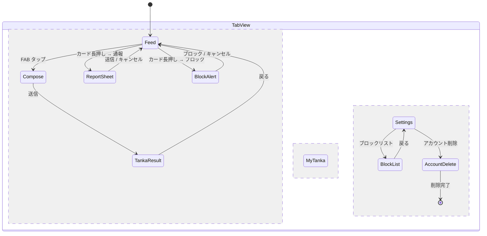
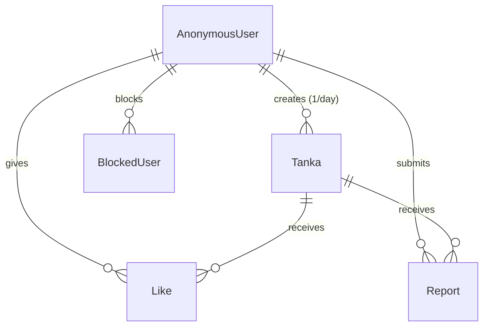

# 機能設計書

> 生成日時: 2026-02-27
> ステータス: Draft
> 入力: docs/product-requirements.md

## 1. 画面一覧

| # | 画面名 | 概要 | 主要コンポーネント |
|---|---|---|---|
| S-001 | ホーム / フィード | 他ユーザーの短歌カードが流れるメイン画面 | ScrollView, TankaCard, TabBar |
| S-002 | 悩み入力 | カテゴリ選択 + テキスト入力 | CategoryPicker, TextEditor, Button |
| S-003 | 短歌表示 | AI 生成した短歌をカードで表示 | TankaCard, ProgressView |
| S-004 | マイ短歌履歴 | 自分の短歌カード一覧 | ScrollView, TankaCard, TabBar |
| S-005 | 設定 | アプリ設定・アカウント管理 | List, NavigationLink |
| S-006 | 通報シート | 不適切な短歌の通報 | Sheet, RadioButton, Button |
| S-007 | ブロック確認 | ブロックの確認ダイアログ | Alert |
| S-008 | アカウント削除 | アカウント削除の確認 | TextField, Button |
| S-009 | ブロックリスト | ブロック中ユーザーの管理 | List, Button |

## 2. 画面詳細仕様

### 2.1 ホーム / フィード画面（S-001）

#### レイアウト構成

```
TabView
├── NavigationStack ("フィード" tab)
│   ├── ScrollView
│   │   └── LazyVStack
│   │       └── ForEach(tankaCards)
│   │           └── TankaCard
│   │               ├── [表面] VStack
│   │               │   ├── Text (カテゴリラベル)     # 小さく、灰色
│   │               │   ├── Text (悩みテキスト)       # 本文、墨色
│   │               │   └── HStack
│   │               │       ├── Text (日付)
│   │               │       └── LikeButton + Text (いいね数)
│   │               └── [裏面] VStack
│   │                   └── VerticalText (短歌)       # 縦書き、明朝体
│   └── FloatingActionButton ("今日の短歌を詠む")
├── NavigationStack ("わたしの歌" tab)
│   └── S-004
└── NavigationStack ("設定" tab)
    └── S-005
```

#### 状態一覧

| プロパティ | 種別 | 型 | 説明 |
|---|---|---|---|
| viewModel | @State | FeedViewModel | フィード画面の ViewModel |
| selectedTab | @State | AppTab | 選択中のタブ |

#### ユーザーインタラクション

| アクション | 結果 |
|---|---|
| カードタップ | カードがフリップし、裏面の縦書き短歌を表示 |
| カード再タップ | カードが元に戻り、表面の悩みを表示 |
| いいねボタンタップ | いいね状態をトグル。いいね数を更新 |
| カード長押し | コンテキストメニュー（通報 / ブロック）を表示 |
| 下方向スクロール | 次のページを読み込み（無限スクロール） |
| プルリフレッシュ | フィードを最新に更新 |
| FAB タップ | 悩み入力画面（S-002）に遷移。本日作成済みの場合は無効状態 |

#### エラー状態

| エラー種別 | 表示 |
|---|---|
| ネットワークエラー | 「接続できませんでした」+ リトライボタン |
| 空フィード | 「まだ短歌がありません」メッセージ |
| 1日制限到達 | FAB を無効化、「明日また詠めます」ツールチップ |

### 2.2 悩み入力画面（S-002）

#### レイアウト構成

```
NavigationStack
└── VStack
    ├── Text ("今日のお悩みを教えてください")    # タイトル、墨色
    ├── Spacer
    ├── HStack                                    # カテゴリ選択
    │   ├── CategoryChip ("人間関係")
    │   ├── CategoryChip ("恋愛")
    │   ├── CategoryChip ("仕事")
    │   └── CategoryChip ("健康")
    ├── Spacer
    ├── TextEditor (placeholder: "ここにお悩みを...")
    ├── HStack
    │   ├── Text ("10〜200文字")                  # 文字数ガイド
    │   └── Text ("\(count)/200")                 # 現在文字数
    ├── Text ("※ 個人情報は含めないでください。短歌は他の方にも公開されます。")
    └── Button ("短歌を詠む")
```

#### 状態一覧

| プロパティ | 種別 | 型 | 説明 |
|---|---|---|---|
| viewModel | @State | ComposeViewModel | 入力画面の ViewModel |
| selectedCategory | @State | WorryCategory? | 選択中のカテゴリ |
| worryText | @State | String | 悩みテキスト |

#### ユーザーインタラクション

| アクション | 結果 |
|---|---|
| カテゴリチップタップ | 該当カテゴリを選択（単一選択） |
| テキスト入力 | 文字数カウント更新。200文字超で入力不可 |
| 「短歌を詠む」タップ | バリデーション → 短歌生成画面（S-003）に遷移 |

#### バリデーション

| 条件 | エラー表示 |
|---|---|
| カテゴリ未選択 | 「カテゴリを選んでください」 |
| テキスト 10 文字未満 | 「もう少し詳しく教えてください」 |
| テキスト 200 文字超 | 入力不可（文字数制限） |

### 2.3 短歌表示画面（S-003）

#### レイアウト構成

```
VStack
├── [生成中] VStack
│   ├── ProgressView (カスタム: 筆が動くようなアニメーション)
│   └── Text ("短歌を詠んでいます...")
└── [生成完了] TankaCard
    ├── [表面] VStack
    │   ├── Text (カテゴリ)
    │   └── Text (自分の悩み)
    └── [裏面] VStack
        └── VerticalText (生成された短歌)
```

#### 状態一覧

| プロパティ | 種別 | 型 | 説明 |
|---|---|---|---|
| viewModel | @State | TankaGenerationViewModel | 短歌生成 ViewModel |
| isFlipped | @State | Bool | カードの表裏状態 |

#### ユーザーインタラクション

| アクション | 結果 |
|---|---|
| 画面表示 | 自動的に短歌生成を開始 |
| カードタップ | フリップアニメーションで表裏切替 |
| 「フィードに戻る」タップ | ホーム画面に戻る |

#### エラー状態

| エラー種別 | 表示 |
|---|---|
| 生成失敗 | 「短歌を詠めませんでした」+ リトライボタン |
| タイムアウト | 「時間がかかっています。もう一度お試しください」 |

### 2.4 マイ短歌履歴画面（S-004）

#### レイアウト構成

```
NavigationStack
└── ScrollView
    └── LazyVStack
        └── ForEach(myTankaCards)
            └── TankaCard
                ├── [表面] VStack
                │   ├── Text (カテゴリ)
                │   ├── Text (悩みテキスト)
                │   └── HStack
                │       ├── Text (日付)
                │       └── Text (いいね数)
                └── [裏面] VStack
                    └── VerticalText (短歌)
```

#### 状態一覧

| プロパティ | 種別 | 型 | 説明 |
|---|---|---|---|
| viewModel | @State | MyTankaViewModel | 履歴画面の ViewModel |

#### エラー状態

| エラー種別 | 表示 |
|---|---|
| 空データ | 「まだ短歌がありません。今日の悩みを詠んでみましょう」 |
| オフライン | ローカルキャッシュを表示（いいね数は最終同期時点） |

### 2.5 設定画面（S-005）

#### レイアウト構成

```
NavigationStack
└── List
    ├── Section ("通知")
    │   └── Toggle ("毎日のリマインダー")
    ├── Section ("アカウント")
    │   ├── NavigationLink ("ブロックリスト") → S-009
    │   └── Button ("アカウントを削除") → S-008
    ├── Section ("情報")
    │   ├── NavigationLink ("利用規約") → SafariView
    │   ├── NavigationLink ("プライバシーポリシー") → SafariView
    │   └── Text ("バージョン X.X.X")
```

### 2.6 通報シート（S-006）

#### レイアウト構成

```
Sheet
└── VStack
    ├── Text ("通報する理由を選んでください")
    ├── VStack
    │   ├── RadioButton ("不適切な内容")
    │   ├── RadioButton ("スパム")
    │   └── RadioButton ("その他")
    └── HStack
        ├── Button ("キャンセル")
        └── Button ("送信")
```

### 2.7 ブロック確認（S-007）

```
Alert
├── Title: "このユーザーをブロックしますか？"
├── Message: "このユーザーの短歌がフィードに表示されなくなります"
├── Button ("ブロック") → destructive
└── Button ("キャンセル")
```

### 2.8 アカウント削除（S-008）

#### レイアウト構成

```
NavigationStack
└── VStack
    ├── Text ("アカウントを削除すると、すべてのデータが完全に消去されます。この操作は取り消せません。")
    ├── Text ("確認のため「削除」と入力してください")
    ├── TextField (placeholder: "削除")
    └── Button ("アカウントを削除する") → destructive, disabled until text == "削除"
```

### 2.9 ブロックリスト（S-009）

#### レイアウト構成

```
NavigationStack
└── List
    └── ForEach(blockedUsers)
        └── HStack
            ├── Text ("ブロック中のユーザー #XXX")
            └── Button ("解除")
```

## 3. 画面遷移仕様



### 遷移パラメータ

| 遷移元 | 遷移先 | パラメータ | 型 |
|---|---|---|---|
| Feed | Compose | なし | - |
| Compose | TankaResult | category, worryText | WorryCategory, String |
| Feed | ReportSheet | tankaID | String |
| Feed | BlockAlert | authorID | String |
| Settings | BlockList | なし | - |
| Settings | AccountDelete | なし | - |

## 4. データモデル一覧

### 4.1 エンティティ定義

#### Tanka（短歌）

| プロパティ | 型 | 制約 | 説明 |
|---|---|---|---|
| id | String | Identifiable, 必須 | 短歌の一意識別子 |
| authorID | String | 必須 | 作成者の匿名 ID |
| category | WorryCategory | 必須 | 悩みのカテゴリ |
| worryText | String | 必須, 10〜200文字 | 悩みのテキスト |
| tankaText | String | 必須 | AI 生成の短歌テキスト |
| likeCount | Int | 必須, >= 0 | いいね数 |
| isLikedByMe | Bool | クライアント側計算 | 自分がいいね済みか |
| createdAt | Date | 必須 | 作成日時 |
| isReported | Bool | デフォルト false | 通報による非表示フラグ |

#### WorryCategory（悩みカテゴリ）

| ケース | 表示名 | 説明 |
|---|---|---|
| relationship | 人間関係 | 友人・知人との関係 |
| love | 恋愛 | 恋愛に関する悩み |
| work | 仕事 | 仕事・キャリアの悩み |
| health | 健康 | 身体・心の健康 |

#### Report（通報）

| プロパティ | 型 | 制約 | 説明 |
|---|---|---|---|
| id | String | Identifiable, 必須 | 通報の一意識別子 |
| tankaID | String | 必須 | 通報対象の短歌 ID |
| reporterID | String | 必須 | 通報者の匿名 ID |
| reason | ReportReason | 必須 | 通報理由 |
| createdAt | Date | 必須 | 通報日時 |

#### ReportReason（通報理由）

| ケース | 表示名 |
|---|---|
| inappropriate | 不適切な内容 |
| spam | スパム |
| other | その他 |

#### BlockedUser（ブロック）

| プロパティ | 型 | 制約 | 説明 |
|---|---|---|---|
| id | String | Identifiable, 必須 | ブロックレコード ID |
| blockerID | String | 必須 | ブロックした側の匿名 ID |
| blockedID | String | 必須 | ブロックされた側の匿名 ID |
| createdAt | Date | 必須 | ブロック日時 |

### 4.2 エンティティ関連図



### 4.3 Swift 型定義例

```swift
struct Tanka: Codable, Sendable, Identifiable {
    let id: String
    let authorID: String
    let category: WorryCategory
    let worryText: String
    let tankaText: String
    var likeCount: Int
    var isLikedByMe: Bool
    let createdAt: Date
}

enum WorryCategory: String, Codable, Sendable, CaseIterable {
    case relationship
    case love
    case work
    case health

    var displayName: String {
        switch self {
        case .relationship: "人間関係"
        case .love: "恋愛"
        case .work: "仕事"
        case .health: "健康"
        }
    }
}

enum ReportReason: String, Codable, Sendable, CaseIterable {
    case inappropriate
    case spam
    case other

    var displayName: String {
        switch self {
        case .inappropriate: "不適切な内容"
        case .spam: "スパム"
        case .other: "その他"
        }
    }
}
```

## 5. API インターフェース仕様

### 5.1 POST /api/v1/tanka/generate

悩みテキストとカテゴリから短歌を生成する。

#### リクエスト

```swift
struct GenerateTankaRequest: Codable, Sendable {
    let category: WorryCategory
    let worryText: String
}
```

#### レスポンス

```swift
struct GenerateTankaResponse: Codable, Sendable {
    let tanka: Tanka
}
```

#### エラー

| ステータス | 説明 |
|---|---|
| 400 | バリデーションエラー（文字数不正等） |
| 429 | 1日1回制限超過 |
| 500 | 短歌生成失敗 |

### 5.2 GET /api/v1/tanka/feed

公開短歌フィードを取得する（ページネーション付き）。

#### リクエスト

| パラメータ | 型 | 必須 | 説明 |
|---|---|---|---|
| limit | Int | 任意 | 取得件数（デフォルト 20） |
| afterID | String | 任意 | カーソルベースページネーション用 |

#### レスポンス

```swift
struct FeedResponse: Codable, Sendable {
    let tankaList: [Tanka]
    let hasMore: Bool
    let nextCursor: String?
}
```

### 5.3 POST /api/v1/tanka/:id/like

短歌にいいねを付ける。

#### レスポンス

```swift
struct LikeResponse: Codable, Sendable {
    let likeCount: Int
}
```

### 5.4 DELETE /api/v1/tanka/:id/like

短歌のいいねを取り消す。

#### レスポンス

```swift
struct UnlikeResponse: Codable, Sendable {
    let likeCount: Int
}
```

### 5.5 GET /api/v1/tanka/mine

自分の短歌一覧を取得する。

#### レスポンス

```swift
struct MyTankaResponse: Codable, Sendable {
    let tankaList: [Tanka]
}
```

### 5.6 POST /api/v1/tanka/:id/report

短歌を通報する。

#### リクエスト

```swift
struct ReportRequest: Codable, Sendable {
    let reason: ReportReason
}
```

#### レスポンス

HTTP 204 No Content

### 5.7 POST /api/v1/users/:id/block

ユーザーをブロックする。

#### レスポンス

HTTP 204 No Content

### 5.8 DELETE /api/v1/users/:id/block

ユーザーのブロックを解除する。

#### レスポンス

HTTP 204 No Content

### 5.9 GET /api/v1/users/blocked

ブロックリストを取得する。

#### レスポンス

```swift
struct BlockedUsersResponse: Codable, Sendable {
    let blockedUsers: [BlockedUser]
}
```

### 5.10 DELETE /api/v1/account

アカウントと全データを削除する。

#### レスポンス

HTTP 204 No Content

## 6. 共通コンポーネント

| コンポーネント | 概要 | 使用画面 |
|---|---|---|
| TankaCard | フリップ可能な短歌カード（表: 悩み、裏: 縦書き短歌） | S-001, S-003, S-004 |
| VerticalText | 縦書きテキスト表示（明朝体） | TankaCard 内 |
| CategoryChip | カテゴリ選択チップ | S-002 |
| LikeButton | いいねボタン（トグル式） | TankaCard 内 |
| LoadingView | ローディング表示 | 全画面 |
| ErrorView | リトライボタン付きエラー表示 | 全画面 |
| EmptyStateView | 空データ時のメッセージ表示 | S-001, S-004 |
