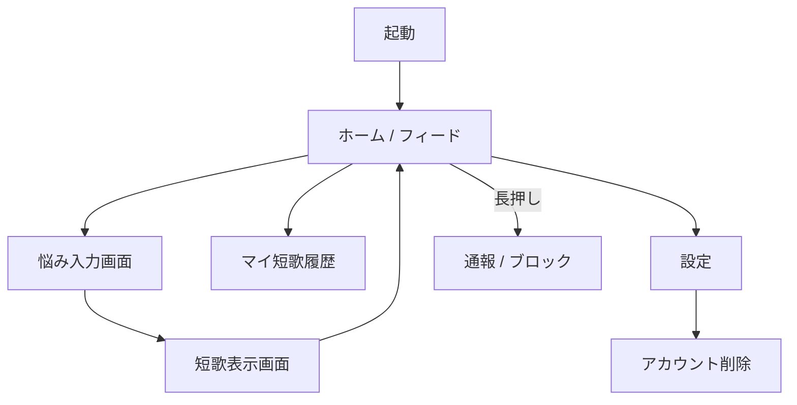

# プロダクト要求定義書

> 生成日時: 2026-02-27
> ステータス: Approved

## 1. プロダクト概要

### 1.1 目的

「kokorouta（こころうた）」は、ユーザーの日常の悩みに AI が短歌（5-7-5-7-7）で答えるアプリである。言葉の力で心を軽くし、他のユーザーの悩みと短歌を通じて「自分だけじゃない」という共感を生み出す。

### 1.2 ターゲットユーザー

- 日常のストレスや悩みを抱える 20〜40 代
- 短歌・詩・言葉に癒しを感じる人
- SNS 疲れしているが、ゆるやかな繋がりは求めている人

### 1.3 解決する課題

- 悩みを言語化する場がない（相談するほどでもない小さな悩み）
- カウンセリングやメンタルヘルスアプリは敷居が高い
- 既存の SNS は情報過多で疲れる

kokorouta は「1日1回、悩みを短歌に変える」というシンプルな体験で、心のケアを日常に溶け込ませる。

### 1.4 デザインコンセプト

**キーワード**: 和風・質素・シンプル・暖かい

- **配色**: 基本的に色は使わない。白を基調とした余白の多いレイアウト
- **文字色**: 純粋な黒（#000000）ではなく、墨色に近い灰色（#333〜#555 程度）を使用
- **フォント**: 明朝体系のフォント（游明朝、ヒラギノ明朝等）を短歌表示に使用。UI テキストにはシステムフォントのウェイト軽めを使用
- **装飾**: 最小限。罫線や区切りは極力使わず、余白で構造を表現
- **アニメーション**: 控えめで自然な動き。カードフリップは滑らかに
- **全体の雰囲気**: 和紙に墨で書かれた短歌を読むような、静かで暖かい体験

## 2. ユーザーストーリー一覧

| # | 優先度 | ストーリー | 受け入れ条件 |
|---|---|---|---|
| US-001 | Must | ユーザーとして、お悩みのカテゴリを選択してテキストで悩みを入力したい、なぜなら自分の気持ちを整理したいから | カテゴリ選択 + テキスト入力ができること |
| US-002 | Must | ユーザーとして、悩みに対して AI が生成した短歌を読みたい、なぜなら言葉の力で心を軽くしたいから | 短歌（5-7-5-7-7）が表示されること |
| US-003 | Must | ユーザーとして、過去にもらった短歌をカード形式で見返したい、なぜなら気に入った短歌をまた読みたいから | 日付順にカード一覧で表示されること |
| US-004 | Must | ユーザーとして、他のユーザーの悩みと短歌をフィードで見たい、なぜなら共感や新しい気づきを得たいから | フィードにカードが表示され、タップで短歌が読めること |
| US-005 | Must | ユーザーとして、フィードの短歌に「いいね」したい、なぜなら共感を伝えたいから | いいねボタンが押せ、いいね数が表示されること |
| US-006 | Must | ユーザーとして、1日1回だけ短歌を作りたい、なぜなら毎日の習慣として特別感を持ちたいから | 1日1回の制限が機能すること |
| US-007 | Must | ユーザーとして、カードの表に悩みが表示され、タップすると裏返って縦書きの短歌が読めるようにしたい、なぜなら短歌を味わう体験をしたいから | カードフリップアニメーションで縦書き短歌が表示されること |
| US-008 | Should | ユーザーとして、悩みに個人情報を含めないよう注意喚起されたい、なぜなら短歌が他ユーザーに公開されるから | 入力画面に注意文言が表示されること |
| US-009 | Must | ユーザーとして、不適切な短歌を通報したい、なぜなら安心してフィードを閲覧したいから | 通報ボタンから理由を選択して送信できること |
| US-010 | Must | ユーザーとして、特定のユーザーをブロックしたい、なぜなら不快なコンテンツを見たくないから | ブロック後そのユーザーの短歌がフィードに表示されないこと |
| US-011 | Must | ユーザーとして、自分のアカウントを削除したい、なぜならデータの管理権を持ちたいから | 設定からアカウント削除でき、全データが消去されること |
| US-012 | Could | ユーザーとして、気に入った短歌を画像として共有したい、なぜなら SNS に投稿したいから | シェアボタンで短歌画像を共有できること |
| US-013 | Won't | ユーザーとして、プロフィールを設定したい | v1 ではスコープ外 |
| US-014 | Won't | ユーザーとして、他のユーザーにコメントしたい | v1 ではスコープ外 |

### 優先度の定義（MoSCoW）

- **Must**: リリースに必須
- **Should**: 重要だがリリースブロッカーではない
- **Could**: あれば嬉しい
- **Won't**: 今回のスコープ外

## 3. 画面フロー

### 画面一覧

| 画面名 | 概要 |
|---|---|
| ホーム / フィード | 他ユーザーの短歌カードが流れるメイン画面 |
| 悩み入力画面 | カテゴリ選択 + テキスト入力 |
| 短歌表示画面 | AI が生成した短歌をカード形式で表示 |
| マイ短歌履歴 | 自分が過去にもらった短歌のカード一覧 |
| 設定 | アプリ設定・アカウント削除 |
| 通報シート | 不適切な短歌の通報（コンテキストメニューから表示） |
| ブロック確認 | ユーザーブロックの確認ダイアログ |

## 4. 機能要件

### 4.1 ホーム / フィード画面

| 項目 | 内容 |
|---|---|
| 入力 | なし（自動読み込み） |
| 処理 | Firestore から他ユーザーの短歌カードを取得し、新着順に表示 |
| 出力 | 短歌カード一覧（表: 悩みテキスト + カテゴリ、裏: 縦書き短歌）、いいねボタン + いいね数 |

- カードは表面に悩みが表示され、タップすると裏返って縦書きの短歌が読める
- 無限スクロールでページネーション
- カード長押しでコンテキストメニュー（通報 / ブロック）を表示
  - 通報: 理由選択（不適切な内容 / スパム / その他）→ 送信
  - ブロック: 確認ダイアログ → そのユーザーの短歌を非表示

### 4.2 悩み入力画面

| 項目 | 内容 |
|---|---|
| 入力 | カテゴリ選択（人間関係 / 恋愛 / 仕事 / 健康）、悩みテキスト（自由記述） |
| 処理 | 入力バリデーション、1日1回制限チェック |
| 出力 | 入力完了後、短歌生成をリクエスト |

- カテゴリは単一選択（必須）
- テキストは 10〜200 文字（必須）
- 「個人情報を含めないでください」の注意文言を表示
- 本日すでに作成済みの場合は入力不可（次回作成可能時刻を表示）

### 4.3 短歌表示画面

| 項目 | 内容 |
|---|---|
| 入力 | 悩み入力画面からの遷移（カテゴリ + テキスト） |
| 処理 | OpenAI API で短歌を生成し、Firestore に保存 |
| 出力 | 生成された短歌をカード形式で表示（縦書き・白地・黒文字） |

- 生成中はローディングアニメーション
- カード表面: 自分の悩み、裏面: 縦書き短歌
- フィードへの共有は自動（個人情報注意喚起済み）

### 4.4 マイ短歌履歴画面

| 項目 | 内容 |
|---|---|
| 入力 | なし |
| 処理 | ローカル保存 + Firestore から自分の短歌を取得 |
| 出力 | 日付降順のカード一覧 |

- カード形式（フリップで悩み ↔ 短歌）
- いいね数も表示

### 4.5 設定画面

| 項目 | 内容 |
|---|---|
| 入力 | 各種設定値 |
| 処理 | UserDefaults / ローカルストレージに保存 |
| 出力 | 設定一覧 |

- 通知設定（毎日のリマインダー）
- ブロックリスト管理（ブロック解除）
- アカウント削除
- アプリバージョン表示
- 利用規約・プライバシーポリシーリンク

### 4.6 アカウント削除

| 項目 | 内容 |
|---|---|
| 入力 | 削除確認（テキスト入力「削除」で確定） |
| 処理 | Firebase Anonymous Auth アカウント削除、Firestore 上の全データ（短歌・いいね）を削除 |
| 出力 | 削除完了後、初期状態に戻る |

- 確認ダイアログで「この操作は取り消せません」と警告
- 削除後はアプリを初期状態にリセット（新しい匿名アカウントで再開可能）

### 4.7 通報機能

| 項目 | 内容 |
|---|---|
| 入力 | 通報理由の選択（不適切な内容 / スパム / その他） |
| 処理 | Firestore の reports コレクションに記録。一定数の通報で自動非表示 |
| 出力 | 「通報しました」の確認メッセージ |

- フィードのカード長押し → コンテキストメニューから「通報」を選択
- UI はシンプルなシート表示（アプリの素朴な雰囲気を壊さない）

### 4.8 ブロック機能

| 項目 | 内容 |
|---|---|
| 入力 | ブロック確認 |
| 処理 | Firestore の blockedUsers コレクションに記録。フィード取得時にフィルタリング |
| 出力 | そのユーザーの短歌がフィードに表示されなくなる |

- フィードのカード長押し → コンテキストメニューから「ブロック」を選択
- 確認ダイアログ表示（「このユーザーの短歌が表示されなくなります」）
- 設定画面からブロック解除可能

## 5. 非機能要件

| カテゴリ | 要件 |
|---|---|
| パフォーマンス | フィードの初期読み込みは 2 秒以内。短歌生成は 5 秒以内 |
| アクセシビリティ | VoiceOver 対応（縦書きテキストの読み上げ順序を考慮）、Dynamic Type 対応 |
| オフライン対応 | マイ短歌履歴はローカルキャッシュで閲覧可能。フィードはオンライン必須 |
| セキュリティ | OpenAI API キーはクライアントに含めず Cloud Functions 経由で呼び出し。ユーザーは匿名認証（Firebase Anonymous Auth） |
| ローカライゼーション | 日本語のみ（初期リリース） |
| データ保持 | 短歌データは Firestore に永続保存 |

## 6. 外部依存

### 6.1 API エンドポイント（Cloud Functions）

| メソッド | パス | 概要 |
|---|---|---|
| POST | /api/v1/tanka/generate | 悩みテキストとカテゴリから短歌を生成 |
| GET | /api/v1/tanka/feed | 公開短歌フィードを取得（ページネーション付き） |
| POST | /api/v1/tanka/:id/like | 短歌にいいねを付ける |
| DELETE | /api/v1/tanka/:id/like | 短歌のいいねを取り消す |
| GET | /api/v1/tanka/mine | 自分の短歌一覧を取得 |
| POST | /api/v1/tanka/:id/report | 短歌を通報する |
| POST | /api/v1/users/:id/block | ユーザーをブロックする |
| DELETE | /api/v1/users/:id/block | ユーザーのブロックを解除する |
| GET | /api/v1/users/blocked | ブロックリストを取得 |
| DELETE | /api/v1/account | アカウントと全データを削除 |

### 6.2 サードパーティ SDK

| SDK | 用途 | バージョン |
|---|---|---|
| Firebase iOS SDK | Firestore, Cloud Functions, Anonymous Auth | 最新安定版 |
| OpenAI API | 短歌生成（Cloud Functions 経由） | GPT-4o |

## 7. 受け入れ条件

| # | 条件 | 検証方法 |
|---|---|---|
| AC-001 | カテゴリ（4種）を選択し、悩みテキストを入力して送信できること | 入力画面で操作して確認 |
| AC-002 | 送信後、AI が 5-7-5-7-7 の短歌を生成して表示すること | 短歌表示画面で音数を確認 |
| AC-003 | 短歌が縦書き・白地・黒文字のカード形式で表示されること | 短歌表示画面のデザインを確認 |
| AC-004 | カード表面に悩み、タップでフリップして裏面に短歌が表示されること | タップ操作で確認 |
| AC-005 | 1日1回の制限が機能すること（2回目は作成不可） | 同日に2回作成を試みて確認 |
| AC-006 | フィードに他ユーザーの短歌カードが新着順で表示されること | フィード画面を開いて確認 |
| AC-007 | フィードのカードにいいねボタンがあり、押すといいね数が増えること | いいねボタンを操作して確認 |
| AC-008 | マイ短歌履歴に過去の短歌がカード形式で日付降順に表示されること | 履歴画面を開いて確認 |
| AC-009 | オフライン時にマイ短歌履歴が閲覧できること | 機内モードで履歴画面を開いて確認 |
| AC-010 | 悩み入力画面に個人情報に関する注意文言が表示されること | 入力画面で確認 |
| AC-011 | フィードのカード長押しで通報・ブロックのメニューが表示されること | 長押し操作で確認 |
| AC-012 | 通報送信後「通報しました」の確認が表示されること | 通報操作で確認 |
| AC-013 | ブロック後、そのユーザーの短歌がフィードに表示されないこと | ブロック後フィードを確認 |
| AC-014 | 設定画面からブロックを解除できること | ブロックリストで操作して確認 |
| AC-015 | 設定画面からアカウント削除ができること | 削除操作後、アプリが初期状態に戻ることを確認 |
| AC-016 | アカウント削除で Firestore 上の全データが消去されること | Firebase コンソールで確認 |

## 8. 成功指標（KPI）

| 指標 | 目標値 | 計測方法 |
|---|---|---|
| DAU | 500 人（リリース後 3 ヶ月） | Firebase Analytics |
| 短歌生成率 | DAU の 30% が毎日短歌を生成 | Cloud Functions ログ |
| リテンション率（7日） | 40% | Firebase Analytics |
| いいね率 | フィード閲覧者の 20% がいいねを押す | Firestore 集計 |
| クラッシュフリー率 | 99.9% | Firebase Crashlytics |

## 9. スコープ外

- ユーザープロフィール機能
- フォロー / フォロワー機能
- コメント / リプライ機能
- 短歌以外の形式（俳句、詩など）
- 多言語対応（初期リリースは日本語のみ）
- 有料プラン / 課金機能
- Android 版
